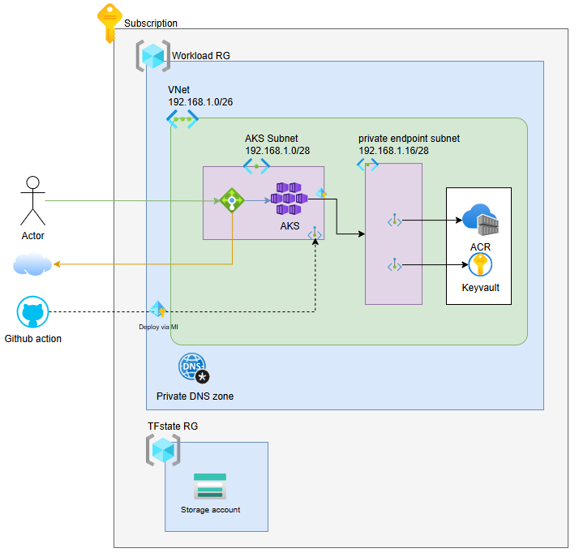

# Repository for infra as code
# Landingzone

# Structure
- Module store in directory ```modules``` path
- tfvars store in ```env-<env>/<env>.tfvars``` file
- Backend state define in ```env-<env>/azurerm.tfbackend``` file
- **File Naming Convention:**
  Files are structured using a consistent naming pattern to ensure clarity and order.
  ```
  <running_number>-<type>-<resource_name>.tf
  ```
  - `<running_number>`: A numbered prefix (e.g., `0040`) to control the order of execution.
  - `<type>`: A single letter indicating the file's purpose (`r` for resource, `v` for variable).
  - `<resource_name>`: A descriptive name for the resource (e.g., `vault`).

  **Example:**
  - `0040-r-vault.tf`: Contains the resource definitions for the Key Vault.
  - `0040-v-vault.tf`: Contains the variable declarations for the Key Vault.

- **Resource File Structure:**
  Each resource configuration file (`-r-`) is organized into three main blocks:

  1.  **Naming Convention Block:**
      This block uses the `terraform-azurerm-naming` module to generate standardized names for Azure resources.
      ```terraform
      module "naming_keyvault" {
        source = "github.com/corp-ais/terraform-azurerm-naming.git?ref=v0.0.8"

        resource_region = var.region
        resource_env    = var.environment
        resource_list = [
          {
            resource_type  = "key_vault"
            resource_name  = lower(var.project_prefix)
            instance_start = 1
            instance_count = 1
          },
          {
            resource_type  = "private_endpoint"
            resource_name  = "${var.project_prefix}KeyVault"
            instance_start = 1
            instance_count = 1
          },
        ]
      }
      ```

  2.  **Dependency Resources Block:**
      This section defines resources that the main resource depends on, such as Private DNS zones, RBAC, or Managed Identities.
      ```terraform
      data "azurerm_private_dns_zone" "keyvault" {
        name                = "privatelink.vaultcore.azure.net"
        resource_group_name = local.resourcegroup_name
      }

      resource "azurerm_private_dns_zone_virtual_network_link" "keyvault" {
        name                  = "link-${local.virtual_network_name}"
        resource_group_name   = local.resourcegroup_name
        private_dns_zone_name = data.azurerm_private_dns_zone.keyvault.name
        virtual_network_id    = module.vnet.vnet_id

        depends_on = [
          module.vnet,
        ]
      }
      ```

  3.  **Main Resource Block:**
      This block defines the primary resource using a local module.
      ```terraform
      module "keyvault" {
        source = "./modules/vault/"
        # ... other resource-specific variables
      }
      ```
# Use remote backend for state management
Terraform state management is crucial for tracking the resources defined in your configuration. Using a remote backend, such as Azure Storage, offers several benefits:
-   **Collaboration:** Enables multiple team members to work on the same infrastructure.
-   **Durability:** State files are stored reliably and are not lost if a local machine fails.
-   **Security:** Remote backends often support encryption and access control for state files.
-   **Versioning:** State changes can be versioned, allowing for rollbacks if needed.

## Setup Azure Storage Account for Remote Backend

To configure Azure Storage as your remote backend, follow these steps:

1.  **Define Parameters:**
    Set the necessary environment variables for your Azure subscription and project.

    ```bash
    export TF_WORKSPACE=<dev|prd>
    SUBSCRIPTION_ID="..."
    STORAGE_REGION="eastus2"
    STORAGE_NAME="sttfstatedemoapp001"
    RESOURCEGROUP_NAME="rg-tfstate"
    ```

2.  **Create Resource Group:**
    Create an Azure Resource Group to host your storage account.

    ```bash
    az group create \
      --subscription ${SUBSCRIPTION_ID} \
      --name ${RESOURCEGROUP_NAME} \
      --location ${STORAGE_REGION}
    ```

3.  **Create Azure Storage Account:**
    Provision an Azure Storage Account within the created resource group.

    ```bash
    az storage account create \
      --subscription ${SUBSCRIPTION_ID} \
      --name ${STORAGE_NAME} \
      --resource-group ${RESOURCEGROUP_NAME} \
      --location ${STORAGE_REGION} \
      --sku Standard_LRS
    ```

4.  **Create Blob Container:**
    Create a blob container within your storage account to store the Terraform state files.

    ```bash
    az storage container create \
      --subscription ${SUBSCRIPTION_ID} \
      --account-name ${STORAGE_NAME} \
      --name tfstate
    ```

5.  **Create `tfbackend` Parameter File:**
    Generate the `azurerm.tfbackend` file in your environment-specific directory (`env-<env>/`) to configure the remote backend.

    ```bash
    cat << EoF > env-<env>/azurerm.tfbackend
    resource_group_name  = "${RESOURCEGROUP_NAME}"
    storage_account_name = "${STORAGE_NAME}"
    container_name       = "tfstate"
    key                  = "main"
    EoF
    ```

# Procedure to provision
## Prerequisite
- Terraform [Link](https://developer.hashicorp.com/terraform/install)
- Azure CLI [Link](https://learn.microsoft.com/en-us/cli/azure/install-azure-cli?view=azure-cli-latest)
- Azure Programmatic name region list [Link](https://learn.microsoft.com/th-th/azure/reliability/regions-list#azure-regions-list-1)
- RBAC ```contributor``` and ```user access administrator``` or ```owner``` on current user
## Run terraform provision
- Terraform `fmt` / `init` and `validate`

```bash
terraform fmt
terraform init -backend-config=env-$TF_WORKSPACE/azurerm.tfbackend -reconfigure
terraform validate
```

- Terraform `plan` / `apply`

```bash
terraform plan -var-file=env-$TF_WORKSPACE/$TF_WORKSPACE.tfvars
terraform apply -var-file=env-$TF_WORKSPACE/$TF_WORKSPACE.tfvars
```